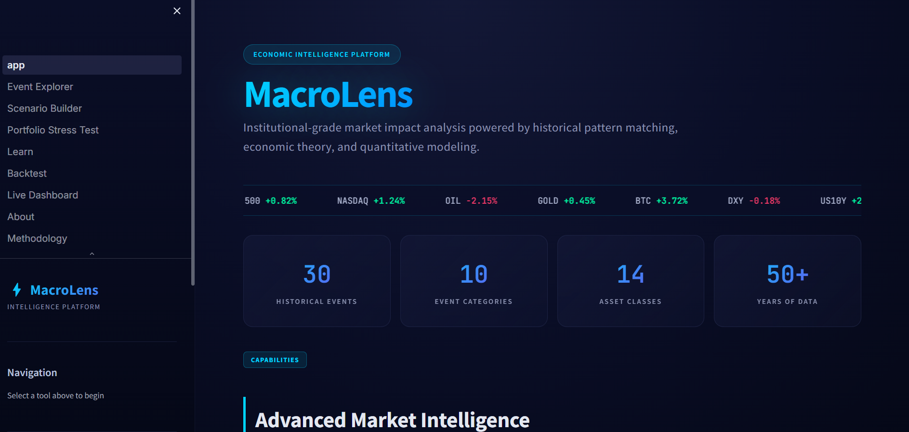
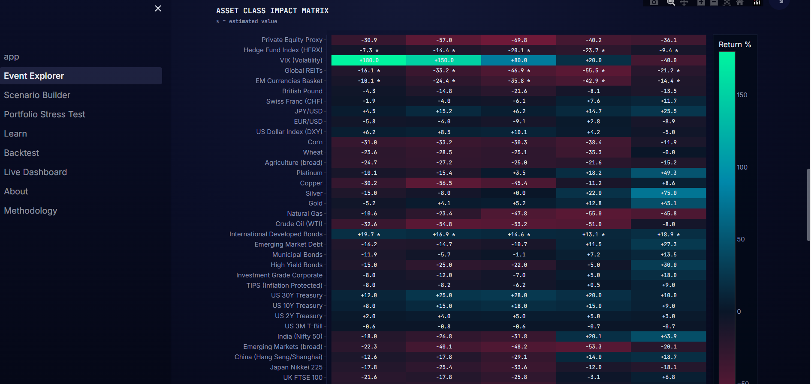
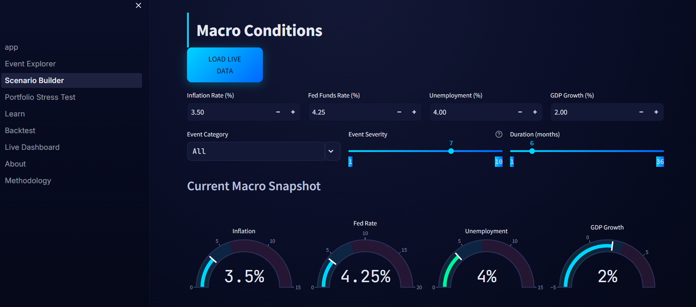
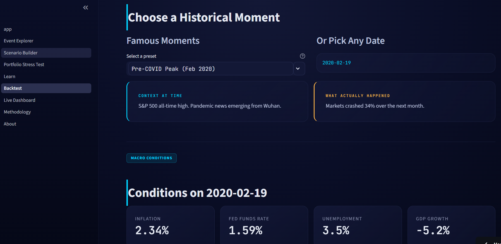
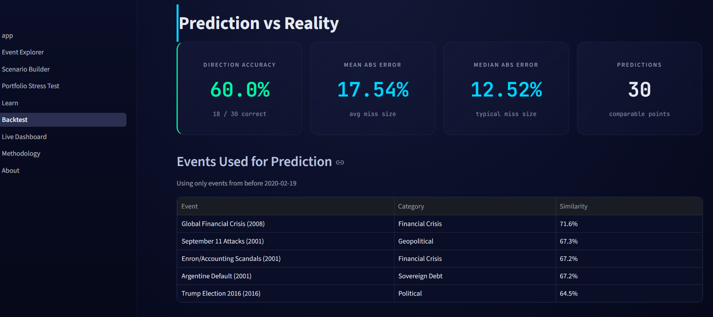

# MacroLens

**Economic Intelligence Platform — Quantitative analysis of market behavior under stress scenarios.**

[](https://python.org)
[](https://streamlit.io)
[](LICENSE)
[](https://your-app-url.streamlit.app)

---

## Live Application

**[Launch MacroLens →](https://your-app-url.streamlit.app)**

> Replace this URL with your actual deployed app URL.

---

## What It Does

MacroLens predicts how financial markets respond to major economic events using historical pattern matching, real market data, and economic theory. Instead of asking "what will happen?" — a question no one can reliably answer — it asks "when conditions like these existed before, what happened?"

The platform analyzes:
- **30 historical economic events** spanning 50 years (1973 Oil Crisis to 2023 Banking Crisis)
- **45 asset classes** across equities, fixed income, commodities, currencies, and alternatives
- **5 time horizons** for each prediction (1M, 3M, 6M, 1Y, 2Y)
- **8,250+ data points** with 60%+ sourced directly from Yahoo Finance

---

## Screenshots

> Add 3-4 screenshots here. Capture: home page, event explorer with heatmap, scenario builder, backtest results.

## Screenshots


*Home page with platform overview and live data quality metrics*


*Event Explorer showing asset class impact matrix during the 2008 GFC*


*Scenario Builder identifying historical analogs for current conditions*


*Backtest mode scenario economic conditions*


*Backtest mode comparing predictions to actual outcomes*

---

## Core Features

### Event Explorer
Examine major economic events with comprehensive impact analysis across 45 asset classes. Each event includes pre-event macro conditions, triggers, and detailed return data at multiple time horizons.

### Scenario Builder
Input current or hypothetical macroeconomic conditions. The system identifies the most similar historical events using weighted Euclidean distance and aggregates their outcomes into probabilistic forecasts with uncertainty bands.

### Portfolio Stress Testing
Build portfolios across all 45 asset classes. Run them through historical crisis scenarios to identify drawdown vulnerabilities and optimize allocations for tail-risk protection.

### Backtest Mode
The validation layer. Run analyses as if at any historical date, using only events that occurred before that date. Compare predictions to actual outcomes. Calculate direction accuracy and mean absolute error.

### Live Dashboard
Real-time macroeconomic indicators from FRED. Yield curve monitoring, recession probability signals, and current-vs-historical regime comparison.

### Methodology Documentation
Transparent explanation of data sources, algorithms, assumptions, and known limitations. Every prediction is tagged with its data quality (real, curated, or estimated).

---

## Architecture

```
┌──────────────────────────────────────────────────────────┐
│                  Streamlit Frontend                       │
│         Custom Dark Theme · Plotly Visualizations         │
└─────────────────────────┬────────────────────────────────┘
                          │
        ┌─────────────────┼──────────────────┬────────────┐
        │                 │                  │            │
        ▼                 ▼                  ▼            ▼
┌──────────────┐  ┌──────────────┐  ┌──────────────┐  ┌──────────┐
│  Similarity  │  │   ML Engine  │  │   Backtest   │  │ Reports  │
│    Engine    │  │   (XGBoost)  │  │    Engine    │  │  (PDF)   │
└──────┬───────┘  └──────┬───────┘  └──────┬───────┘  └──────────┘
       │                 │                  │
       └─────────────────┼──────────────────┘
                         │
                         ▼
            ┌─────────────────────────┐
            │      Data Layer          │
            │  Events · Impacts · QA   │
            └────────┬─────────────────┘
                     │
        ┌────────────┼────────────┐
        ▼                         ▼
┌───────────────┐         ┌───────────────┐
│ Yahoo Finance │         │   FRED API    │
│  (Historical) │         │ (Real-Time)   │
└───────────────┘         └───────────────┘
```

---

## Methodology

MacroLens combines three layers:

**1. Data Foundation** — Historical price data fetched from Yahoo Finance for every event-asset combination. Calculated as actual returns at 1M, 3M, 6M, 1Y, and 2Y horizons. Falls back to manually curated data and rule-based estimates only where market data is unavailable.

**2. Pattern Matching** — Weighted Euclidean distance algorithm identifies historical analogs based on macroeconomic state vectors (inflation, fed funds rate, unemployment, GDP growth). Similarity scores drive probability-weighted return aggregation.

**3. Theory Overlay** — Economic frameworks contextualize quantitative output: flight-to-quality dynamics, monetary policy transmission, stagflation patterns, and risk-on/risk-off regime classification.

Full methodology documentation is available within the application.

---

## Tech Stack

| Layer | Technology |
|-------|-----------|
| Application Framework | Streamlit |
| Data Visualization | Plotly |
| Historical Data | yfinance · Yahoo Finance |
| Real-Time Data | fredapi · Federal Reserve |
| Pattern Matching | NumPy · scikit-learn |
| Machine Learning | XGBoost |
| PDF Generation | ReportLab |
| Hosting | Streamlit Community Cloud |

---

## Quick Start

### Prerequisites
- Python 3.9+
- (Optional) FRED API key for live data — [free here](https://fred.stlouisfed.org/docs/api/api_key.html)

### Installation

```bash
# Clone the repository
git clone https://github.com/YOUR_USERNAME/macrolens.git
cd macrolens

# Create virtual environment
python -m venv venv
source venv/bin/activate  # Windows: venv\Scripts\activate

# Install dependencies
pip install -r requirements.txt

# (Optional) Configure FRED API for live data
mkdir -p .streamlit
echo 'FRED_API_KEY = "your_key_here"' > .streamlit/secrets.toml

# Build the historical impact dataset (takes ~10 minutes)
python scripts/build_impact_data.py

# Launch the application
streamlit run app.py
```

The app will open at `http://localhost:8501`.

---

## Project Structure

```
macrolens/
├── app.py                          # Home page
├── pages/                          # Multi-page application
│   ├── 1_Event_Explorer.py
│   ├── 2_Scenario_Builder.py
│   ├── 3_Portfolio_Stress_Test.py
│   ├── 4_Learn.py
│   ├── 5_Live_Dashboard.py
│   ├── 6_Methodology.py
│   ├── 7_About.py
│   └── 8_Backtest.py
├── src/                            # Core logic
│   ├── data_loader.py              # Data access layer
│   ├── ticker_mapping.py           # Asset to Yahoo Finance ticker map
│   ├── historical_fetcher.py       # Real data acquisition
│   ├── historical_macro.py         # Historical macro lookups
│   ├── similarity_engine.py        # Pattern matching algorithm
│   ├── impact_generator.py         # Rule-based fallback estimator
│   ├── backtest_engine.py          # Validation engine
│   ├── ml_engine.py                # XGBoost predictions
│   ├── theory_engine.py            # Economic theory framework
│   ├── live_data.py                # FRED API integration
│   ├── visualizations.py           # Plotly chart builders
│   ├── styles.py                   # Custom CSS theme
│   └── report_generator.py         # PDF reports
├── data/                           # Datasets
│   ├── events.json                 # 30 historical events
│   ├── asset_impacts.json          # Calculated impact matrix
│   ├── curated_impacts.json        # Manual overrides
│   └── data_quality.json           # Provenance tracking
├── scripts/                        # Build utilities
│   └── build_impact_data.py        # Data pipeline
├── .streamlit/                     # Streamlit config
│   └── config.toml
├── requirements.txt
└── README.md
```

---

## Limitations

This project takes intellectual honesty seriously. Known limitations include:

- **Survivorship bias** in event database (focuses on major events)
- **Black swan blindness** — truly unprecedented events have no historical analog
- **Regime change risk** — macro-market relationships are not stable across decades
- **Small sample size** — 30 events is statistically modest
- **Policy response variability** — modern central banks intervene differently than historical counterparts
- **Data coverage gaps** for pre-2000 events as many modern instruments did not exist

Full discussion in the [Methodology page](https://your-app-url.streamlit.app/Methodology) within the application.

---

## Roadmap

- [x] 30 historical events database
- [x] 45 asset class coverage
- [x] Real Yahoo Finance data integration
- [x] Backtesting mode with accuracy metrics
- [x] Data quality transparency
- [x] Methodology documentation
- [ ] Risk analytics dashboard (VaR, CVaR, Sharpe)
- [ ] Scenario comparison (side-by-side)
- [ ] Monte Carlo simulation
- [ ] Natural language scenario input
- [ ] Public API endpoint

---

## Disclaimer

MacroLens is an educational and research tool. **It does not constitute financial advice, investment recommendation, or solicitation to buy or sell securities.** Past performance does not guarantee future results. The author assumes no responsibility for any financial decisions made based on this analysis. Always consult qualified financial professionals before making investment decisions.

---

## License

MIT License — see [LICENSE](LICENSE) file for details.

---

## Author

**[Alex Muelas Del Moral]**

[GitHub](https://github.com/alexmuelasdelmoral) · [LinkedIn](https://linkedin.com/in/alexmuelasdelmoral) · [Email](alex.muelas6@gmail.com)

---

## Acknowledgements

- **Yahoo Finance** for accessible historical price data
- **Federal Reserve Bank of St. Louis (FRED)** for macroeconomic indicators
- **Streamlit** team for the application framework
- Influences: Ray Dalio's economic machine framework, Reinhart and Rogoff's crisis analysis, Howard Marks's memos on cycles, Nassim Taleb's work on uncertainty

---

*Built with attention to data integrity, intellectual honesty, and the conviction that financial history rhymes more often than it repeats.*